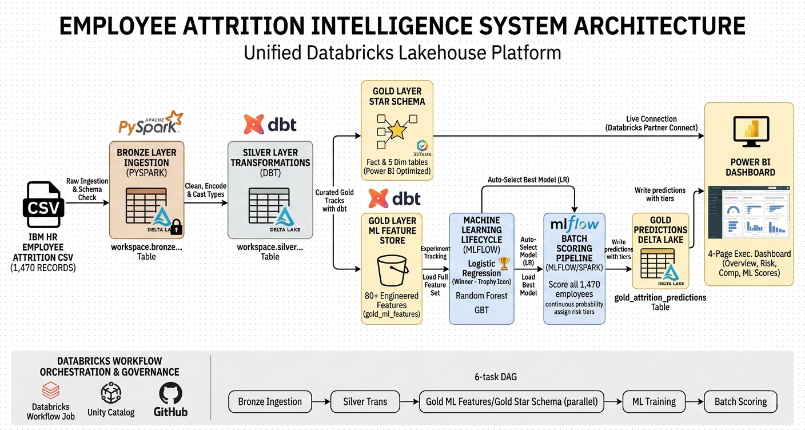
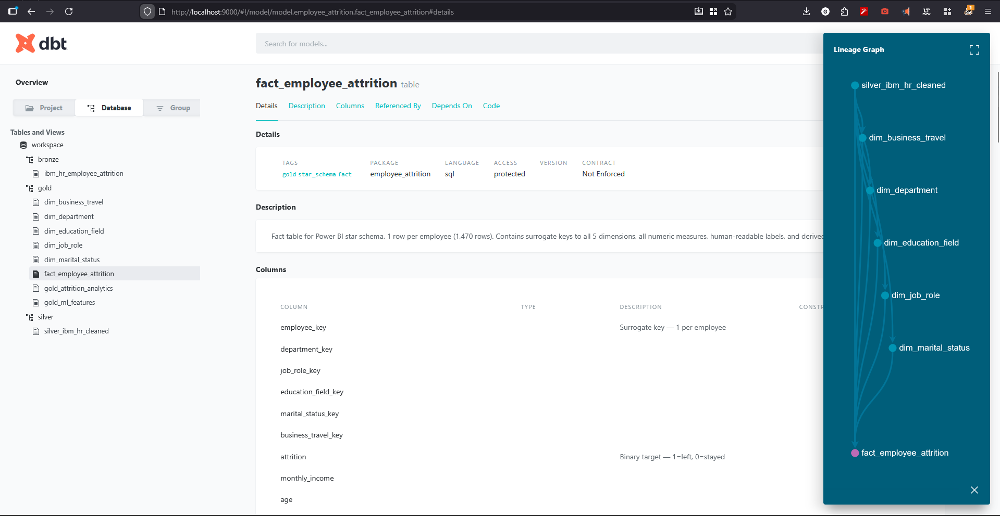
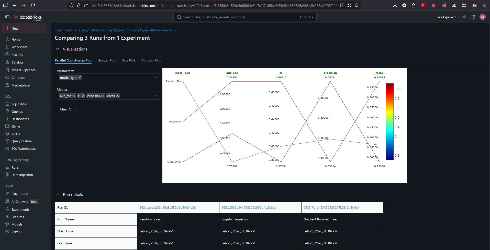
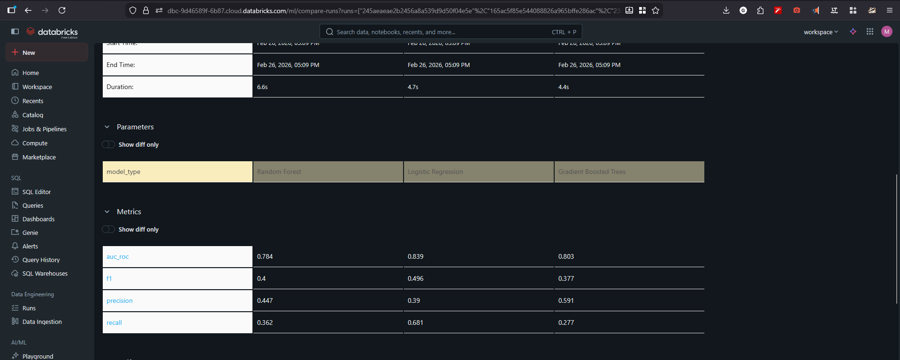
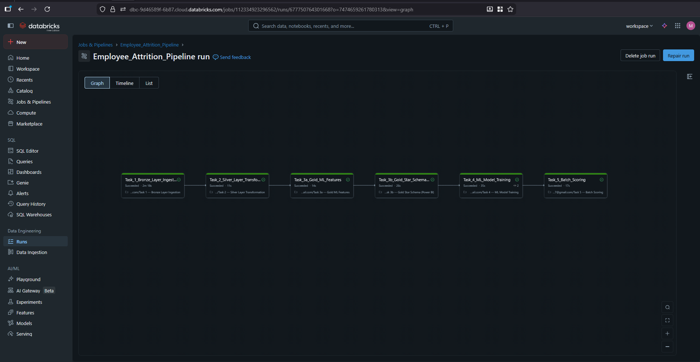
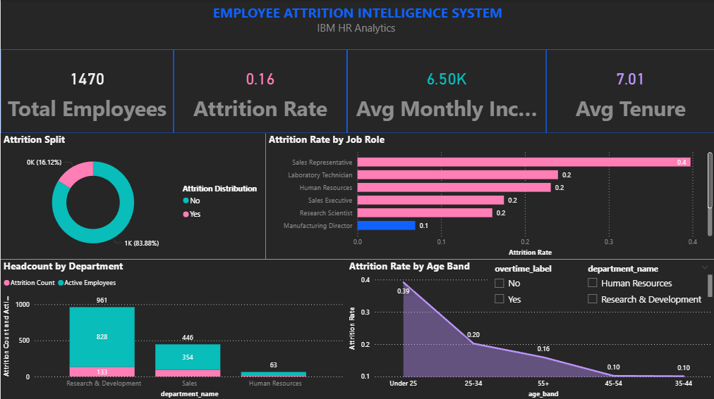
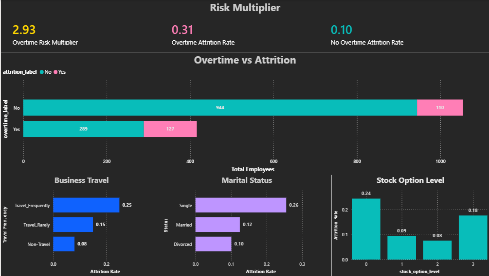
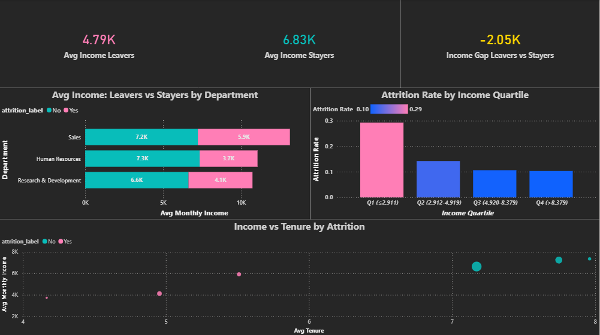
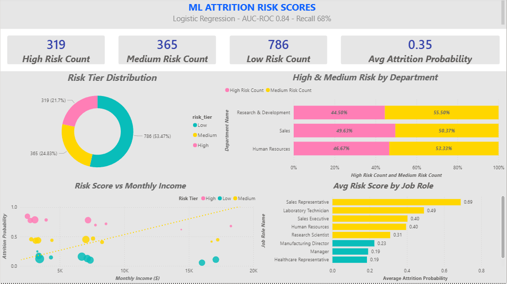

# Employee Attrition Intelligence System

[](https://www.databricks.com/)
[](https://spark.apache.org/)
[](https://www.getdbt.com/)
[](https://mlflow.org/)
[](https://powerbi.microsoft.com/)
[](https://www.python.org/)
[](https://spark.apache.org/sql/)

An end-to-end data engineering and machine learning project that predicts employee attrition using the IBM HR Analytics dataset. Built on Databricks with a Medallion architecture (Bronze → Silver → Gold), dbt for transformation orchestration, MLflow for experiment tracking, and Power BI for executive dashboards.



---

## Project Highlights

- **Medallion Data Pipeline** - Raw CSV ingested into Bronze, cleaned and typed in Silver, modeled into a star schema in Gold via dbt on Databricks.
- **3 ML Models Trained & Compared** - Logistic Regression, Random Forest, and Gradient-Boosted Trees evaluated on a class-imbalanced dataset using AUC-ROC, F1, and Recall as primary metrics.
- **Batch Scoring Pipeline** - Best model loaded from MLflow, scores all 1,470 employees, writes risk predictions (probability + tier) back to Gold layer. Closes the loop from training to actionable output.
- **Pipeline Orchestration** - Automated Databricks Workflow Job with a 6-task DAG (Bronze → Silver → Gold → ML Training → Scoring), inter-task communication via `dbutils.jobs.taskValues`, and a single-notebook driver for quick full runs.
- **Star Schema for BI** - 5 dimension tables + 1 fact table designed for direct Power BI consumption with surrogate keys and referential integrity enforced through 32 dbt tests.
- **Interactive Power BI Dashboards** - 4-page executive dashboard with IBM Carbon Design dark theme, covering attrition overview, risk factors, compensation analysis, and ML risk scores.


---

## Tech Stack

| Layer | Technology |
|---|---|
| Cloud Platform | Databricks Community Edition |
| Data Ingestion | PySpark (Bronze Layer notebook) |
| Transformations | dbt-core 1.11 + dbt-databricks adapter |
| Data Warehouse | Unity Catalog (`workspace.gold`) |
| ML Training | PySpark MLlib (Logistic Regression, Random Forest, GBT) |
| Experiment Tracking | MLflow |
| Visualization | Power BI Desktop (live Databricks connection) |
| Version Control | Git / GitHub |

---

## Data Pipeline

### Bronze Layer
Raw IBM HR Employee Attrition CSV (1,470 records, 35 features) ingested via PySpark into `workspace.bronze.ibm_hr_employee_attrition`.

### Silver Layer
Transformations handled by dbt (`silver_ibm_hr_cleaned.sql`):
- Column renaming to snake_case
- Binary encoding of categorical targets (`Attrition` → 0/1)
- Ordinal encoding for `BusinessTravel`, `Gender`, `OverTime`
- Type casting and null handling

### Gold Layer
Three purpose-built outputs:

| Model | Purpose | Rows |
|---|---|---|
| `gold_ml_features` | Engineered feature set for ML training (interaction terms, ratios, department aggregates) | 1,470 |
| `gold_attrition_analytics` | Pre-aggregated metrics by 10+ dimensions for exploratory analysis | ~110 |
| `gold_attrition_predictions` | Batch-scored risk predictions from the trained Logistic Regression model | 1,470 |
| **Star Schema** (5 dims + 1 fact) | Power BI-optimized warehouse with surrogate keys and referential integrity | 1,470 |

**Star Schema Design:**

```
dim_department ─────────┐
dim_job_role ───────────┤
dim_education_field ────┼───▶ fact_employee_attrition
dim_marital_status ─────┤       (1,470 rows)
dim_business_travel ────┘
```

All relationships validated with 32 dbt tests (unique, not_null, accepted_values, relationships).

---

## dbt Transformations

All Silver and Gold layer models are built and tested using **dbt-core 1.11** with the **dbt-databricks** adapter. dbt manages the full transformation DAG from raw Bronze data through to the star schema and ML feature store, with 9 models and 32 data quality tests.

- **1 Silver model** - Cleaned and encoded HR dataset
- **8 Gold models** - 5 dimension tables, 1 fact table, ML features, analytics aggregates
- **32 tests** - Primary keys, foreign keys, not-null constraints, accepted values
- **Custom macro** - `generate_schema_name.sql` routes models to the correct Unity Catalog schemas



---

## ML Model Results

Three classifiers trained on the Gold ML feature set with an 80/20 stratified split. The dataset is imbalanced (~16% attrition), so **Recall** was prioritized alongside AUC-ROC to minimize missed attrition cases.

| Model | AUC-ROC | F1 Score | Recall | Precision |
|---|---|---|---|---|
| **Logistic Regression** | **0.8387** | **0.4923** | **0.6809** | 0.3855 |
| Random Forest | 0.7840 | 0.2388 | 0.1702 | 0.4000 |
| Gradient-Boosted Trees | 0.7906 | 0.3750 | 0.3191 | 0.4545 |

**Selected Model:** Logistic Regression - highest AUC-ROC (0.84) and substantially better recall (68%), meaning it correctly identified ~2 out of 3 employees who actually left. The trade-off in precision is acceptable here since the cost of missing an at-risk employee outweighs the cost of a false alert.

**Key Predictive Factors:**
- Overtime status
- Monthly income
- Years at company / total working years
- Job satisfaction & environment satisfaction
- Marital status (Single)
- Business travel frequency

All experiments logged to MLflow with parameters, metrics, the trained model artifact, and a fitted scaler.





### Batch Scoring

The trained model isn't just evaluated - it's deployed as a batch scoring pipeline (`05_ml_batch_scoring.ipynb`):

1. Retrieves the best model + fitted scaler from MLflow (auto-selects by AUC-ROC)
2. Loads the full feature set from `gold_ml_features`
3. Scores all 1,470 employees → continuous attrition probability (0–1)
4. Assigns risk tiers: **High** (>60%), **Medium** (30–60%), **Low** (<30%)
5. Writes `workspace.gold.gold_attrition_predictions` - ready for Power BI

This is the step that turns a trained model into a decision-support tool.

---

## Pipeline Orchestration

The entire pipeline is automated via a **driver notebook** (`00_pipeline_orchestration.ipynb`) that runs all tasks sequentially with validation checkpoints:

```
Task 1: Bronze Ingestion       CSV → Delta table
    │
Task 2: Silver Transformation  Cleaning, encoding, type casting
    │
Task 3: Gold ML Features       80+ engineered features
    │
Task 4: Gold Star Schema       5 dims + 1 fact table
    │
Task 5: ML Model Training      3 models → MLflow (best auto-selected)
    │
Task 6: Batch Scoring          1,470 predictions → Gold table
```

Each task validates row counts and schema before proceeding. If any task fails, the pipeline stops with a clear error. All tables use overwrite mode, making the pipeline fully idempotent.

### Databricks Workflow Job

The pipeline is also deployed as a **multi-task Databricks Workflow Job** with a visual DAG. Tasks 3a (ML Features) and 3b (Star Schema) run in parallel after Silver completes, and the ML Training task passes the `best_run_id` to Batch Scoring via `dbutils.jobs.taskValues`.



---

## Power BI Dashboard

Four-page executive dashboard connected live to Databricks via the SQL connector. Themed with IBM Carbon Design System dark palette.

### Page 1 - Attrition Overview
KPI cards (total employees, attrition rate, avg income, avg tenure), attrition breakdown by department and age band, gender distribution, overtime impact.



### Page 2 - Risk Factors
Satisfaction heatmap, overtime risk multiplier, business travel impact, marital status analysis, years-at-company attrition curve.



### Page 3 - Compensation & Growth
Income distribution by attrition status, income gap analysis (leavers vs stayers), salary hike patterns, stock option impact, experience vs income scatter.



### Page 4 - ML Risk Scores
Batch-scored attrition probabilities from the Logistic Regression model. Risk tier distribution, department breakdown, top at-risk employees table, probability vs income scatter.



---

## Project Structure

```
Employee-Attrition-Intelligence-System/
│
├── databricks/
│   ├── Bronze/
│   │   └── Bronze Layer Ingestion.ipynb       # PySpark CSV → Bronze table
│   └── notebooks/
│       ├── 00_pipeline_orchestration.ipynb    # End-to-end DAG (runs everything)
│       ├── 04_ml_model_training.ipynb         # ML pipeline (3 models + MLflow)
│       ├── 05_ml_batch_scoring.ipynb          # Batch scoring → predictions table
│       ├── Employee Attrition EDA.ipynb       # Exploratory data analysis
│       └── tasks/                             # Individual Workflow Job tasks
│           ├── task_01_bronze_ingestion.py
│           ├── task_02_silver_transformation.py
│           ├── task_03a_gold_ml_features.py
│           ├── task_03b_gold_star_schema.py
│           ├── task_04_ml_training.py
│           └── task_05_batch_scoring.py
│
├── dbt/employee_attrition/
│   ├── dbt_project.yml
│   ├── macros/
│   │   └── generate_schema_name.sql           # Custom schema routing
│   ├── models/
│   │   ├── silver/
│   │   │   ├── silver_ibm_hr_cleaned.sql      # Cleaning + encoding
│   │   │   └── schema.yml
│   │   └── gold/
│   │       ├── dim_department.sql             # 3 departments
│   │       ├── dim_job_role.sql               # 9 roles
│   │       ├── dim_education_field.sql        # 6 fields
│   │       ├── dim_marital_status.sql         # 3 statuses
│   │       ├── dim_business_travel.sql        # 3 levels
│   │       ├── fact_employee_attrition.sql    # Central fact table
│   │       ├── gold_ml_features.sql           # ML feature engineering
│   │       ├── gold_attrition_analytics.sql   # Pre-aggregated analytics
│   │       └── schema.yml                     # 32 tests
│   └── tests/
│
├── dashboards/
│   └── IBM DASHBOARD.pbix                     # Power BI dashboard file
│
├── Dataset/
│   └── WA_Fn-UseC_-HR-Employee-Attrition.csv  # IBM HR dataset (1,470 records)
│
├── screenshots/                                # Dashboard & results screenshots
│
└── README.md
```

---

## How to Reproduce

### Prerequisites
- Databricks workspace (Community Edition works)
- Python 3.10+ with dbt-databricks
- Power BI Desktop (Windows)

### Steps

1. **Upload Data** - Upload the CSV to Databricks DBFS (`dbfs:/FileStore/WA_Fn_UseC__HR_Employee_Attrition.csv`).

2. **Run the Full Pipeline** - Open `00_pipeline_orchestration.ipynb` on Databricks and **Run All**. This single notebook executes Bronze ingestion, Silver/Gold transformations, ML training, and batch scoring in sequence with validation checkpoints.

   Alternatively, run each step individually:
   - `Bronze Layer Ingestion.ipynb` → Bronze table
   - `dbt run && dbt test` → Silver + Gold (9 models, 32 tests)
   - `04_ml_model_training.ipynb` → MLflow experiments
   - `05_ml_batch_scoring.ipynb` → Predictions table

3. **Power BI** - Connect Power BI to your Databricks SQL warehouse, import the star schema tables + predictions table, and build visuals (or open the included `.pbix` file).

---

## Dataset

[IBM HR Analytics Employee Attrition & Performance](https://www.kaggle.com/datasets/pavansubhasht/ibm-hr-analytics-attrition-dataset) - 1,470 employees, 35 features, binary attrition target (~16% positive class).

---

## Author

**Mahmoud Gribej**

Built as a portfolio project demonstrating end-to-end data engineering, machine learning, and business intelligence capabilities on a modern lakehouse platform.
